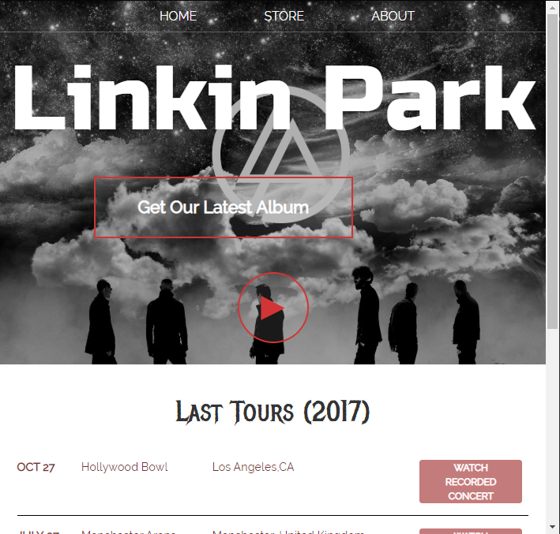
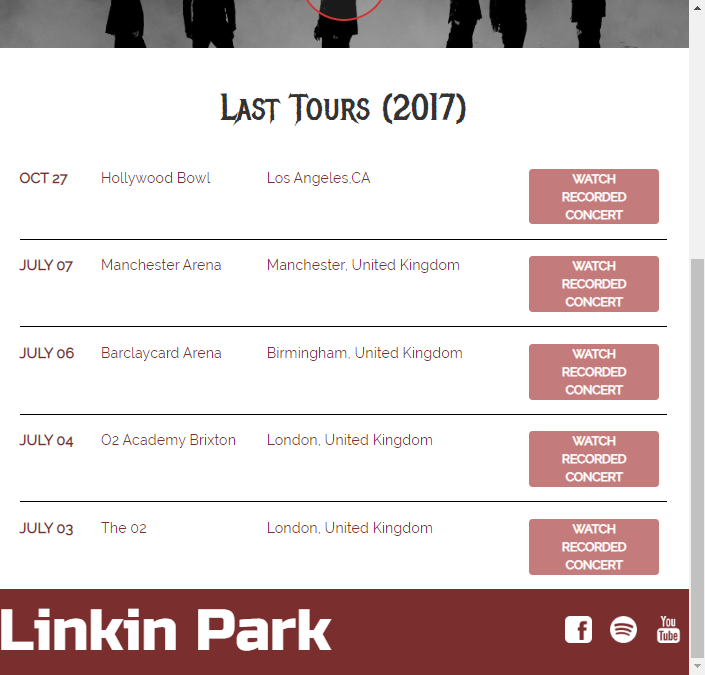
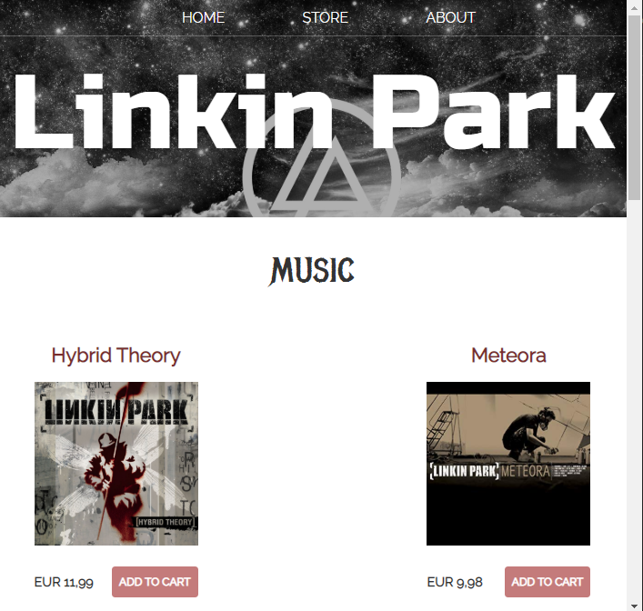
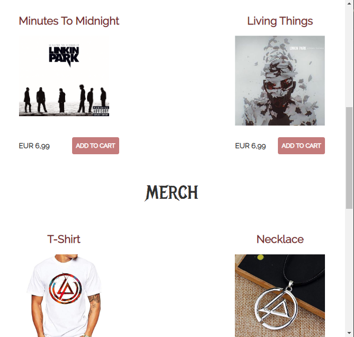
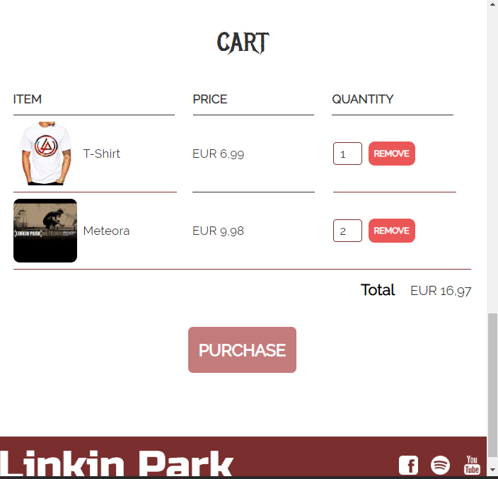
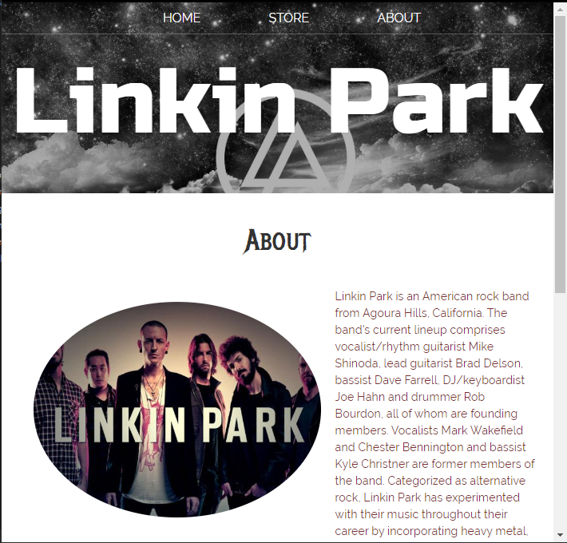
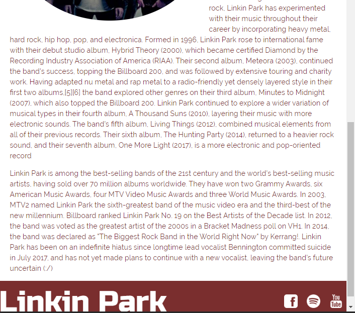

# LinkinPark

Hi! I choose to develop this project to refresh my Web's basics' skills and help beginners in Web Development to start their first own project ! It's a simple web project using only **HTML, CSS, JavaScript** , and it's about my favorite band :D .

## V1.0
Only HTML

## V1.1
CSS added

## V1.2
JavaScript added

## Screenshots 

